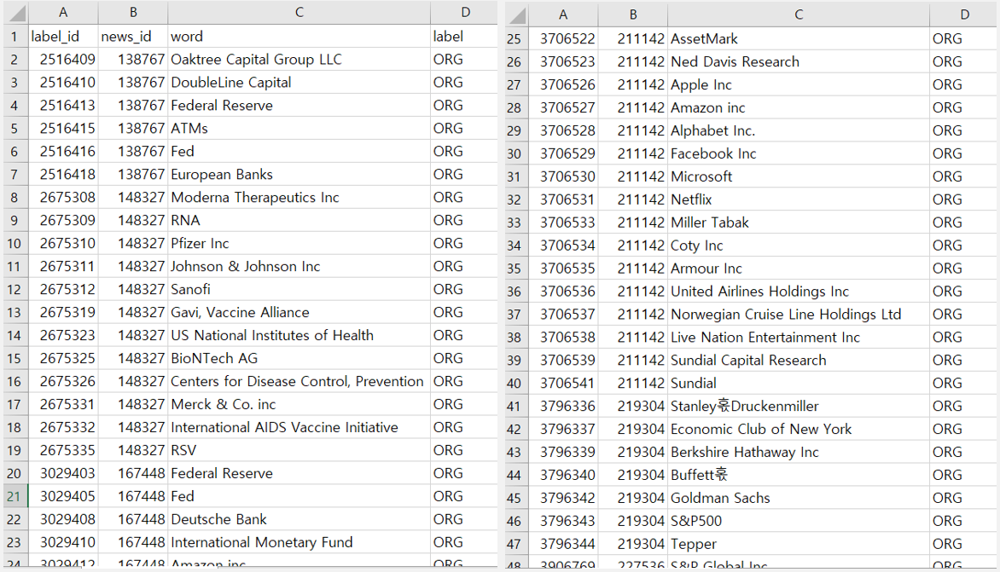
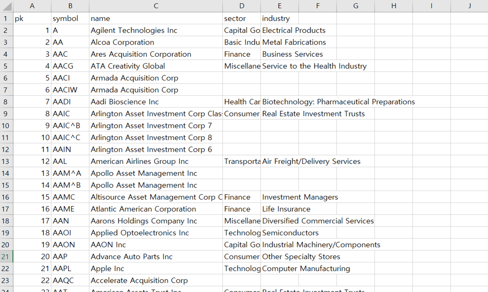
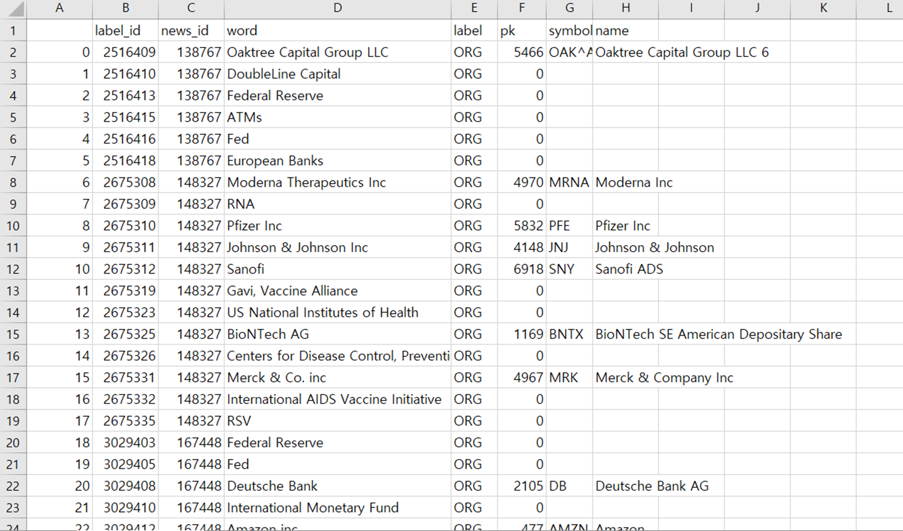

알고리즘을 통해 뉴스 원문에서 기관으로 라벨링된 데이터에서 종목코드를 매핑하는 모델을 만들기

ORG.csv

Stock.csv

전체적인 매핑 흐름
=

1. ORG와 stock list 전처리
2. ORG와 stock의 교집합이 2개 또는 3개 이상일 경우 매핑
3. fuzzy 패키지 사용 - 유사도 계산 (유사도 80초과시 매핑)
4. stock list에서 stock 대표단어란을 따로 생성 ->  
   org에 대표단어가 포함될 경우 매핑 (1-3개)
5. 크롤링 - (유사도 80-84 사이 단어들 중 잘못 매핑된 경우 †   
   -> 구글에서 Ticker 크롤링해서 재매핑)
6. 유사도 90이상 매핑
7. ORG와 stock list 완전 일치시 매핑
8. 절대 stock이 아닐 것 같은 단어들 Non_stock 처리
9. 수작업 처리(bank of)

( 데이터가 커서 ORG 1000개만 뽑아서 매핑 )  
매핑 결과 :  
총 매핑수 : 237 개  
stock을 stock으로 분류한 수 : 204개 중 200개  
Non_stock을 Non_stock으로 분류한 수 : 796개 중 763개

정확도 : 96.3 %
=
매핑 결과 csv
